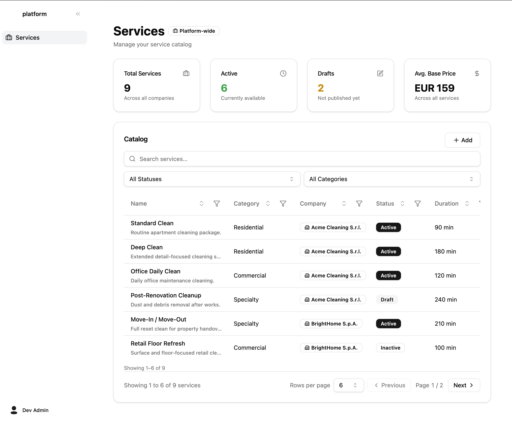

# Cleandrop Fullstack Challenge

Build a small **Services catalog** app with authentication and role-based access. The UI should match the reference below.

---

## Goal

Implement a login flow and a **Services** page at `/services`. After a successful login, redirect the user to `/services`.

Access is controlled by a **JWT** that includes a `role` claim:

| Role | Access |
|------|--------|
| `admin` | Full CRUD on services (create, read, update, delete) |
| `user` | Read-only (list and view services; no create, edit, or delete) |

Enforce authorization on both the **API** and the **UI** (e.g. hide or disable actions the user cannot perform).

---

## UI requirements

Reproduce the Services screen from the preview as closely as is reasonable:

- **Sidebar** with navigation; **Services** is the active item
- **Header**: title, subtitle, and a “Platform-wide” badge
- **Summary cards**: Total Services, Active, Drafts, Avg. Base Price
- **Catalog** section: search, status/category filters, sortable table, pagination
- **“+ Add”** button visible and functional for `admin` only
- Table columns: Name (with description), Category, Company, Status, Duration

You may seed sample data so the page looks like the reference (9 services, mixed statuses, etc.).

---

## Tech stack (required)

| Layer | Stack |
|-------|--------|
| Runtime / package manager | **Bun** |
| Backend | **NestJS** (TypeScript) |
| ORM | **Drizzle ORM** |
| Database | **PostgreSQL** |
| Frontend UI | **shadcn/ui** |
| Tests (backend) | **Jest** |
| Dev environment | **Docker** (app + database runnable via `docker compose`) |

---

## Suggested scope

Minimum deliverables:

1. **Auth**: login endpoint, JWT issuance with `role` (`admin` \| `user`), protected routes
2. **Services API**: CRUD endpoints with role checks
3. **Frontend**: login page → redirect to `/services`; role-aware catalog UI
4. **Docker**: `docker compose up` (or documented equivalent) starts API, DB, and frontend
5. **Tests**: at least a few meaningful backend tests (auth and/or services)

Nice to have (not required): refresh tokens, e2e tests, OpenAPI docs.

---

## Evaluation hints

We will look at:

- Correct **role enforcement** (not only UI hiding)
- **Code structure** and TypeScript usage
- **Docker** setup that is easy to run locally
- **Tests** that cover real behavior
- How close the **UI** is to the reference and how polished it feels

---

## Getting started

1. Fork or clone this repository.
2. Read this file and inspect `challenge-preview.png`.
3. Implement the stack above; document how to run the project in a `README.md`.
4. Submit your solution (repo link or archive) with brief notes on any assumptions you made.

Good luck.
